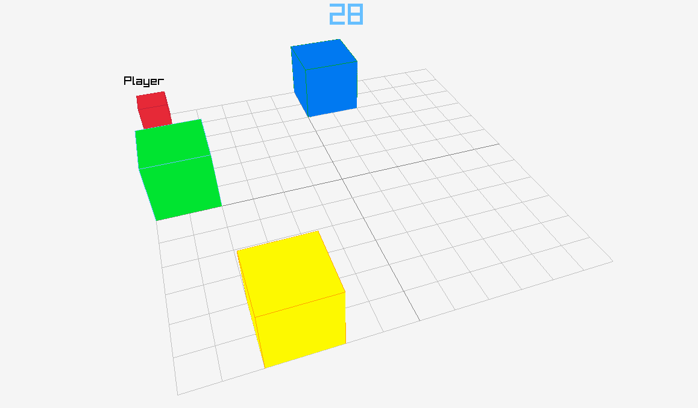

## Description
A simple clone of the Mario Party 5 minigame "Squared away" written in Go using the raylib library.

This is my first time programming in Go so there might be some spaghetti to be found.

